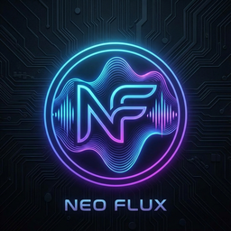

<div align="center">
  

# NEO FLUX

**The Ultimate High-Performance Music Visualizer**

[](<https://en.wikipedia.org/wiki/C_(programming_language)>)
[](https://www.raylib.com/)
[](https://github.com/tsoding/nob.h)
[]()
[]()

  <p align="center">
    <b><a href="#-features">Features</a></b> •
    <b><a href="#-getting-started">Getting Started</a></b> •
    <b><a href="#-controls">Controls</a></b> •
    <b><a href="#-visualizers">Visualizers</a></b>
  </p>
</div>

---

**Neo Flux** transforms your audio into a living, breathing visual experience. Built from scratch in **C** using **Raylib**, it offers a lightweight, bloat-free, and hyper-responsive visualization engine that reacts to every beat with mathematical precision.

## 🚀 Features

- **⚡ Zero Latency**: Direct interaction with audio buffers for instant visual feedback.
- **🎨 10+ Visualization Modes**: From classic Bars to trippy Spirals and Particles.
- **🎤 Live Input**: visualize your voice or ambient noise in real-time.
- **📼 Render to Video**: Export your sessions directly to MP4 (requires FFmpeg).
- **🔌 Hot Reloading**: Tweak shaders and logic in real-time without restarting (Dev mode).
- **🛠️ Zero Dependencies**: Builds with a single command. No Makefiles, no CMake hell.

## 💾 Getting Started

### Prerequisites

- **C Compiler**: GCC, Clang, or MSVC.
- **FFmpeg** (Optional): For video rendering capabilities.

### Installation

1.  **Clone the Repository**

    ```bash
    git clone https://github.com/rahulkumar7189/Neo-Flux.git
    cd Neo-Flux
    ```

2.  **Build**
    Neo Flux uses the `nob` (Nobuild) system.

    - **Windows (MSVC)**:
      ```cmd
      cl nob.c && nob.exe
      ```
    - **Linux / macOS**:
      ```bash
      cc nob.c -o nob && ./nob
      ```

3.  **Run**
    ```bash
    ./build/musializer
    ```

## 🎮 Controls

Designed for keyboard-first control to keep you in the flow.

| Key              | Action           | Description                                 |
| :--------------- | :--------------- | :------------------------------------------ |
| <kbd>SPACE</kbd> | **Play / Pause** | Toggle the music playback.                  |
| <kbd>F</kbd>     | **Fullscreen**   | Toggle fullscreen mode.                     |
| <kbd>R</kbd>     | **Render**       | Start/Stop recording to `render.mp4`.       |
| <kbd>C</kbd>     | **Capture**      | Switch to Microphone input.                 |
| <kbd>M</kbd>     | **Mute**         | Toggle sound (visuals keep playing).        |
| <kbd>H</kbd>     | **Hot Reload**   | Recompile logic (requires dev environment). |
| <kbd>ESC</kbd>   | **Exit**         | Close the application.                      |

## 🌈 Visualizers

Neo Flux includes a diverse set of visualization algorithms. Explore them all!

1.  **Bars**: Traditional frequency analyzer.
2.  **Circle**: Pulsating circular waveform.
3.  **Wave**: Oscilloscope view.
4.  **Spectrum**: High-res frequency heatmaps.
5.  **Particles**: Gravity-defying frequency particles.
6.  **Radial**: Outward exploding radial bars.
7.  **Mirror**: Symmetrical Rorschach-test style visuals.
8.  **Spiral**: Hypnotic spiral patterns.
9.  **Grid**: 2D Grid intensity map.
10. **Pulse**: Concentric ripples.

## 🏗️ Architecture

Built on the **Core + Plugin** hot-reloadable architecture.

- **`musializer.c`**: Host application (Window, Input).
- **`plug.c`**: The Logic (Audio Processing, Rendering).
- **`nob.c`**: The Build System.

## 👥 Credits

**Created & Maintained by Rahul Kumar**

- **Graphics**: [Raylib](https://www.raylib.com/)
- **Audio**: [Miniaudio](https://miniaud.io/)
- **Video**: [FFmpeg](https://ffmpeg.org/)

---

<div align="center">
  <sub>Generated for Neo Flux</sub>
</div>
